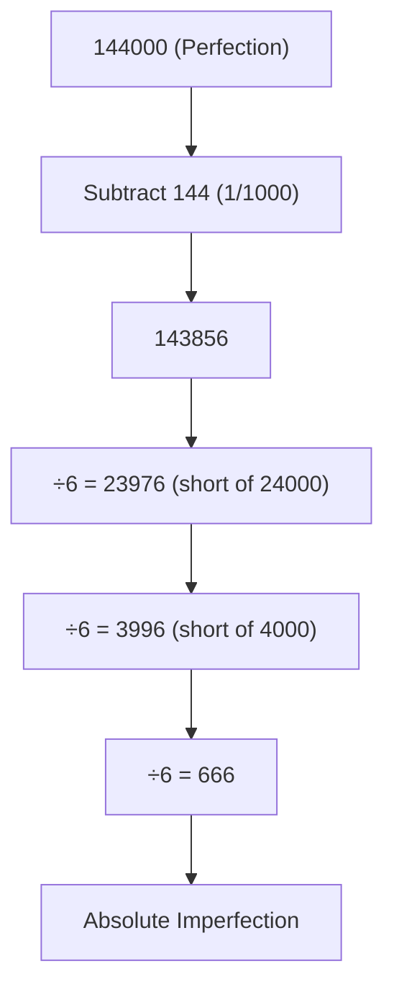

```mermaid
flowchart TD
    A["144000 (Perfection)"] --> B["Subtract 144 (1/1000)"]
    B --> C["143856"]
    C --> D["÷6 = 23976 (short of 24000)"]
    D --> E["÷6 = 3996 (short of 4000)"]
    E --> F["÷6 = 666"]
    F --> G["Absolute Imperfection"]
```